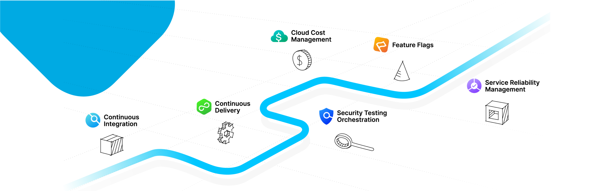

# Harness Public Template Library

## Introduction

- [Harness.io](https://www.harness.io/) User's can use the sample templates to quickly get started with Harness.
- Harness offer's templates at the [Account Level, Organization Level and Project Level](https://developer.harness.io/docs/platform/Templates/template#templates-at-scopes)
- Check out [Harness' Template Library Best Practices](https://github.com/thisrohangupta/harness-consumer-templates-library/blob/main/Best-Practices/template-library-best-practices.md)
- The Templates in this repo are designed for the **Account Level**
- [2 Minute - Get Started Video](https://www.loom.com/share/992e3c457e134a6ea199b70ed039377c) to help you get started with Harness Public Template Library

*Note: This Repository is under active development. The Harness team is adding new Templates to this repo for use.*

## Continuous Delivery

### Pipeline Templates

#### Kubernetes Pipelines Templates

- [Kubernetes Blue Green Deployment](https://github.com/thisrohangupta/harness-consumer-templates-library/blob/main/Pipelines/cd/kubernetes/kubernetes-blue-green-deployment-pipeline.md)

- [Kubernetes Canary Deployment with Canary Continuous Verification](https://github.com/thisrohangupta/harness-consumer-templates-library/blob/main/Pipelines/cd/kubernetes/kubernetes-canary-cv-pipeline.md)

- [Kubernetes Canary Deployment](https://github.com/thisrohangupta/harness-consumer-templates-library/blob/main/Pipelines/cd/kubernetes/kubernetes-canary-deployment-pipeline.md)

- [Kubernetes Rolling Deployment with Rolling Continuous Verification](https://github.com/thisrohangupta/harness-consumer-templates-library/blob/main/Pipelines/cd/kubernetes/kubernetes-rolling-cv-pipeline.md)

- [Kubernetes Rolling Deployment](https://github.com/thisrohangupta/harness-consumer-templates-library/blob/main/Pipelines/cd/kubernetes/kubernetes-rolling-deployment-pipeline.md)

- [Golden Kubernetes Release Pipeline](https://github.com/thisrohangupta/harness-consumer-templates-library/blob/main/Pipelines/cd/kubernetes/kubernetes-golden-pipeline-sample.md)

- [Golden Kubernetes Release Pipeline with Canary Continuous Verification](https://github.com/thisrohangupta/harness-consumer-templates-library/blob/main/Pipelines/cd/kubernetes/kubernetes-golden-pipeline-sample-cv.md)

#### Helm Pipeline Templates

- [Helm Deploy Pipeline Template](https://github.com/thisrohangupta/harness-consumer-templates-library/blob/main/Pipelines/cd/helm/native-helm-deployment.md)

- [Helm Deploy with Rolling Continuous Verification Pipeline Template](https://github.com/thisrohangupta/harness-consumer-templates-library/blob/main/Pipelines/cd/helm/native-helm-deployment-cv.md)

#### Amazon Elastic Container Service Pipeline Templates

- [Amazon Elastic Container Service Blue-Green Deployment Pipeline](https://github.com/thisrohangupta/harness-consumer-templates-library/blob/main/Pipelines/cd/amazon-elastic-container-services/ecs-bluegreen.md)

- [Amazon Elastic Container Service Canary Deployment Pipeline](https://github.com/thisrohangupta/harness-consumer-templates-library/blob/main/Pipelines/cd/amazon-elastic-container-services/ecs-canary.md)

- [Amazon Elastic Container Service Rolling Deployment Pipeline](https://github.com/thisrohangupta/harness-consumer-templates-library/blob/main/Pipelines/cd/amazon-elastic-container-services/ecs-rolling.md)

### Stage Templates

#### Kubernetes Stage Templates

- [Canary Deployment Stage Template](https://github.com/thisrohangupta/harness-consumer-templates-library/blob/main/Stage/cd/kubernetes/canary-k8s-deployment.md)

- [Rolling Deployment Stage Template](https://github.com/thisrohangupta/harness-consumer-templates-library/blob/main/Stage/cd/kubernetes/rolling-k8s-deployment.md)

- [Blue Green Deployment Stage Template](https://github.com/thisrohangupta/harness-consumer-templates-library/blob/main/Stage/cd/kubernetes/blue-green-k8s-deployment.md)

#### Helm Stage Templates

- [Helm Deploy Stage Template](https://github.com/thisrohangupta/harness-consumer-templates-library/blob/main/Stage/cd/helm/helm-deployment.md)

#### Amazon Elastic Container Service Stage Templates

- [Canary Deployment Stage Template](https://github.com/thisrohangupta/harness-consumer-templates-library/blob/main/Stage/cd/amazon-elastic-container-services/ecs-canary.md)

- [Rolling Deployment Stage Template](https://github.com/thisrohangupta/harness-consumer-templates-library/blob/main/Stage/cd/amazon-elastic-container-services/ecs-rolling.md)

- [Blue-Green Deployment Stage Template](https://github.com/thisrohangupta/harness-consumer-templates-library/blob/main/Stage/cd/amazon-elastic-container-services/ecs-bluegreen.md)

## Contributors

- Maintainer: @thisrohangupta
- We welcome contributions, please open up a `Pull-Request` and Assign me for review.